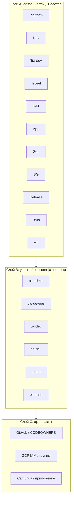

# Организация команды: 11 логических ролей × 6 учёток (концепция)

**Статус:** нормативная модель для HBG / учебного контура; сопоставьте с политикой вашего банка.  
**Связанные документы:** [gcp-saas-access-matrix-11x6](gcp-saas-access-matrix-11x6.md) (матрица доступа), [github-codeowners-matrix](github-codeowners-matrix.md) (Git), [hr-offers-hbg](hr-offers-hbg.md) (U1–U6, RACI, 11 этапов заявки).

**Языки:** [English](/en/team-11x6-organization) · [Polski](/pl/team-11x6-organization)

---

## 1. Зачем вообще «11 × 6»

В регулируемой среде аудитор и риск-офис спрашивают не «сколько у нас логинов», а **кто может изменить что** и **где разрыв цепочки подотчётности**. Две оси отвечают на разные вопросы:

| Ось | Что измеряет | Вопрос, на который отвечает |
|-----|----------------|------------------------------|
| **11 слотов** | *Функции доступа* к облаку, CI, данным | «Какой минимальный набор привилегий нужен *роли* для выполнения обязанности?» |
| **6 учёток** | *Люди* (или сервисные principals), закреплённые в IdP / GitHub | «Как упаковать слоты так, чтобы не плодить 11 человек и не нарушить SoD?» |

**11** — не обязательно 11 сотрудников; это **канонический набор обязанностей** (Platform, Dev, два тестовых контура, UAT/App как «без консоли», Sec, BG, Release, Data, ML). **6** — практичный минимум «пакетов» для старта команды: каждый пакет описан отдельной [страницей персоны](#6-страницы-персон-полный-sdlc).

Инвариант: **IAM в проде вешаем на Google Groups**, человек входит в группы; при увольнении отзываем членство, а не 40 `roles/*` по проекту.

---

## 2. Три слоя модели (не путать)

- **Слой A** фиксирует *что можно* в терминах риска (матрица GCP).  
- **Слой B** фиксирует *кто несёт* пакет слотов в повседневной работе.  
- **Слой C** — где это технически выражено (репо, облако, продукт).

U1–U6 из [hbg-rag-dominance](hbg-rag-dominance.md) / [hr-offers-hbg](hr-offers-hbg.md) — **ещё один срез** (продуктовые «владельцы» контуров), его нужно **сшить** с 11 слотами в реестре ролей банка, а не подменять им.

---

## 3. Полный цикл разработки (SDLC) как «сквозная нить»

Один и тот же SDLC проходит **вся команда**, но **разные фазы** для разных персон — главные (leading). Ниже — обобщённый пайплайн; детализация по персонам — на их страницах.

| Фаза | Смысл | Типичные владельцы слотов | Артефакты |
|------|--------|---------------------------|-----------|
| **0. Инициация** | границы эпика, риски, данные | Platform + Sec (оценка поверхности) | ADR, threat model (лёгкий) |
| **1. Проектирование** | контракты API, схемы данных, BPMN | Dev, Data, ML | OpenAPI, DMN, дизайн индекса |
| **2. Реализация** | код, IaC в dev | Dev, Data, ML, Platform (инфраструктурные PR) | PR в `develop` |
| **3. Интеграция в dev** | compose / dev-кластер | Dev, Platform | CI green, dev namespace |
| **4. Верификация dev** | функциональные тесты, первичный RAG | Tst-dev | отчёты CI, чеклисты |
| **5. Продвижение в ref/staging** | регресс, нагрузка, совместимость | Tst-ref, Release (частично) | релизная ветка, теги по [git-workflow](git-workflow.md) |
| **6. Гейт продакшена** | SoD: кто approve Environment | Release, Sec (по политике) | GitHub Environment `production` |
| **7. UAT / бизнес-приёмка** | сценарии в продукте | UAT (слот без GCP) | Camunda Tasklist, Streamlit |
| **8. Эксплуатация** | SLO, инциденты | Platform, BG по событию | runbooks, postmortem |
| **9. Аудит и неизменяемость** | следы, BQ, политика | Sec, App как субъект использования | логи, выгрузки для U6 |

**UAT** и **App** не имеют строки в GCP-матрице как «консольные роли» — их полномочия живут в **IdP приложения** и бизнес-процессе; это сознательно, чтобы не смешивать «админ облака» и «пользователь кредитного контура».

---

## 4. Разделение обязанностей (SoD) — жёсткие и мягкие правила

| Правило | Суть | Что ломает модель |
|---------|------|-------------------|
| **Release ≠ единственный разработчик** | approve в `production` — у [Release](gcp-saas-access-matrix-11x6.md); автор merge не нажимает «одобрить сам себя» в Environment | один человек = Dev + Release без второго лица |
| **Sec не пишет прод-код под себя** | политики и исключения — через Git / OPA; Sec — reviewer | Sec с `container.admin` и прямым деплоем |
| **BG не постоянная роль** | повышение по тикету, TTL, отзыв | «вечный» break-glass-логин |
| **Data и ML не администрируют GKE в prod** | инжест и модели — свои SA и bucket-префиксы | `roles/container.admin` у data/ml «для удобства» |

В учебном репозитории U1/U2 могут совпадать на одном GitHub-пользователе — в банке это часто **запрещено** для prod; матрица всё равно остаётся эталоном «как должно быть при росте».

---

## 5. Соответствие «4 GitHub Team» из prompt

| Team | Зачем | Какие персоны чаще всего |
|------|--------|--------------------------|
| `platform` | infra, CI, кластер | ok-admin, gw-devops |
| `engineers` | прикладной код, данные, ML | ux-dev, sh-dev |
| `quality` | тест, релизный контроль | pk-qa + участие Release-персоны |
| `compliance` | политика, аудит | ok-audit + Sec-вклад gw-devops (второй голос) |

Команды в GitHub — **гранулярность ревью**; они не заменяют **группы GCP**.

---

## 6. Страницы персон (полный SDLC)

Каждая страница — **одна учётка**, её пакет из 11 слотов, зоны репозитория, GCP, фазы SDLC, взаимодействия и антипаттерны.

| Персона | Ярлык | Страница |
|---------|-------|----------|
| **ok-admin** | ADMIN | [team-persona-ok-admin](team-persona-ok-admin.md) |
| **gw-devops** | DEVOPS | [team-persona-gw-devops](team-persona-gw-devops.md) |
| **ux-dev** | DEV-UX | [team-persona-ux-dev](team-persona-ux-dev.md) |
| **sh-dev** | DEV-SH | [team-persona-sh-dev](team-persona-sh-dev.md) |
| **pk-qa** | QA-TEST | [team-persona-pk-qa](team-persona-pk-qa.md) |
| **ok-audit** | AUDIT | [team-persona-ok-audit](team-persona-ok-audit.md) |

---

## 7. Связь с 11 этапами жизненного цикла заявки (продукт)

В [hr-offers-hbg](hr-offers-hbg.md) описаны этапы ingestion → audit trace. **Команда 11×6** не дублирует эти этапы, а **обеспечивает** их: Data/ML на ранних этапах, Platform/SRE на оркестрации и персистенции, QA на верификации, Sec/Audit на следах. При внедрении заведите **traceability matrix**: этап заявки → слот → группа IAM → персона-владелец.

---

## 8. Чеклист внедрения модели в организации

1. Утвердить **именование групп** в GCP, соответствующее 11 слотам (или субнабору для MVP).  
2. Перенести bindings с людей на **группы**; персонам выдать только группы + минимальные персональные роли (например чтение логов).  
3. Настроить **GitHub Environments** и required reviewers под слот Release / Sec.  
4. Описать **runbook BG** (кто утверждает, TTL, логирование).  
5. Провести **учение**: каждая персона проходит один мини-эпик по [странице SDLC](team-persona-ux-dev.md) (пример полного цикла для разработчика).

**Далее:** вернуться к [gcp-saas-access-matrix-11x6](gcp-saas-access-matrix-11x6.md) как к справочнику «что может слот в GCP».
